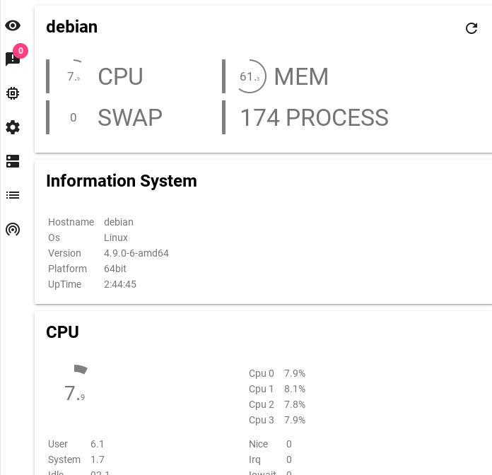

# One Glances

IHM Theme "design material" for glances

You can find glances on https://nicolargo.github.io/glances/

## Installation

you can clone project an copy file in your root path nginx

    git clone https://github.com/fraoustin/one-glances.git
    cp -R * /<path_nginx_root>

You need load glances on computer

    glances -w

You can access on http://127.0.0.1

One Glances use library

- https://github.com/lugolabs/circles
- https://getmdl.io/
- http://www.chartjs.org/

## TODO

- optimize code
- add color
- add chart history
- add docker information
- add action glances
- add speedtest